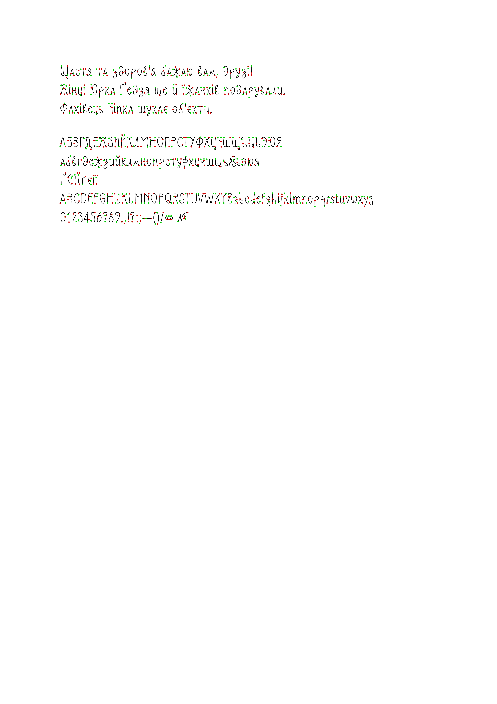

# ✍️ chornyla

[](https://github.com/Avariya/chornyla/actions/workflows/ci.yml)
[](https://github.com/Avariya/chornyla/actions/workflows/deploy.yml)
[](LICENSE)

Convert `.docx` documents into **G-code for pen plotters** using single-stroke
handwriting fonts. Runs entirely in your browser — no server, no install.

**🌐 [Live demo](https://avariya.github.io/chornyla/)**

> _chornyla_ (чорнила) means "ink" in Ukrainian.

[English](#english) · [Українська](#українська)



---

## English

### What it does

A regular font is an **outline** — when a plotter traces it, every letter is
drawn as a double contour (outer + inner edge). `chornyla` uses **single-stroke**
fonts, where each letter is one open path, just like writing by hand with a pen.

Drop in a `.docx`, preview how it will look on paper, tweak the plotter settings,
and download a `.gcode` file ready for your machine.

### Features

- 📄 Reads `.docx` with formatting — margins, indents, tabs, alignment, font size,
  line spacing, and character spacing (condensed/expanded)
- ✒️ Single-stroke fonts — each glyph drawn in one pen pass
- 🔤 Cyrillic (Ukrainian + Russian) and Latin, digits, punctuation
- 🌿 "Living handwriting" effects — subtle randomized offsets for realism
- ⚙️ Configurable G-code — Z-axis or servo pen up/down, feed rates, GRBL-ready
- 🖥️ 100% client-side — works offline, deployable as a static site

### Quick start

**Use the hosted version:** just open the [live demo](https://avariya.github.io/chornyla/).

**Run locally** (requires [Node.js](https://nodejs.org/) 20+):

```bash
git clone https://github.com/Avariya/chornyla.git
cd chornyla
npm install
npm run dev          # http://localhost:5173
```

Production build (a single self-contained HTML file in `dist/`):

```bash
npm run build
```

### How to use

1. Write your text in Word or LibreOffice Writer, set margins / spacing / font size.
2. Save as `.docx`.
3. Open the app and drop the file in.
4. Review the preview of how it will be drawn.
5. Adjust plotter settings (preset, feed rate, effects).
6. Download the `.gcode` and send it to your plotter.

### How it works

```
.docx ─▶ parse (JSZip + DOMParser) ─▶ layout (word-wrap, baseline align)
      ─▶ handwriting effects (seeded PRNG) ─▶ G-code (SVG paths → GRBL moves)
```

- **Parser** reads `word/document.xml` directly for full control over formatting,
  and resolves the document's default (Normal) style.
- **Layout** positions glyphs respecting margins, indents, tabs, alignment and
  line/character spacing; aligns mixed font sizes by baseline.
- **Effects** apply reproducible per-glyph jitter via a seeded PRNG.
- **G-code** flattens Bézier curves and emits configurable pen up/down moves.

### Project structure

```
src/
  core/
    font.ts          single-stroke glyph lookup
    docx-parser.ts   .docx → document model
    layout.ts        text layout → positioned glyphs
    effects.ts       handwriting randomness
    gcode.ts         glyph paths → G-code
    pipeline.ts      orchestrates the above
  ui/app.ts          browser UI
  fonts/             single-stroke font data (JSON)
tests/               visual-regression tests (gcode → PNG snapshots)
fonts/               optional preview fonts for Word (OFL)
```

### Contributing

See [CONTRIBUTING.md](CONTRIBUTING.md). In short: `npm run typecheck && npm run lint
&& npm run format:check && npm run build && npm test` should all pass.

### Credits & license

- Code: [MIT](LICENSE) © Oleksii Romanchenko
- Single-stroke glyph shapes are derived via centerline extraction from the
  **Slimamif** typeface by **Dmitri Zdorov** ([dimka.com](https://dimka.com/fonts)),
  free for personal and commercial use. The original font is **not** redistributed
  here — only derived coordinate data. See [NOTICE.md](NOTICE.md).
- Preview fonts in `fonts/` are licensed under the SIL Open Font License.

---

## Українська

### Що це

Звичайний шрифт — це **контур** (outline): коли плоттер його обводить, кожна
літера малюється подвійною лінією (зовнішній + внутрішній край). `chornyla`
використовує **одноштрихові** шрифти, де кожна літера — один відкритий контур,
як письмо ручкою від руки.

Закидаєте `.docx`, бачите прев'ю як це виглядатиме на папері, налаштовуєте
параметри плоттера і завантажуєте готовий `.gcode`.

### Можливості

- 📄 Читає `.docx` із форматуванням — поля, відступи, таби, вирівнювання, розмір
  шрифту, міжрядковий і міжсимвольний інтервал (ущільнений/розріджений)
- ✒️ Одноштрихові шрифти — кожна літера одним проходом пера
- 🔤 Кирилиця (українська + російська) та латиниця, цифри, пунктуація
- 🌿 Ефекти "живого письма" — невеликі випадкові зміщення для реалістичності
- ⚙️ Конфігурований G-code — Z-axis або servo для pen up/down, GRBL-сумісний
- 🖥️ Повністю в браузері — працює офлайн, розгортається як статичний сайт

### Швидкий старт

**Готова версія:** просто відкрийте [демо](https://avariya.github.io/chornyla/).

**Локально** (потрібен [Node.js](https://nodejs.org/) 20+):

```bash
git clone https://github.com/Avariya/chornyla.git
cd chornyla
npm install
npm run dev          # http://localhost:5173
```

Production-збірка (один самодостатній HTML-файл у `dist/`):

```bash
npm run build
```

### Як користуватись

1. Напишіть текст у Word або LibreOffice Writer, налаштуйте поля / інтервал / розмір.
2. Збережіть як `.docx`.
3. Відкрийте додаток і перетягніть файл.
4. Перегляньте прев'ю — як це буде намальовано.
5. Налаштуйте параметри плоттера (пресет, швидкість, ефекти).
6. Завантажте `.gcode` і передайте на плоттер.

### Як це працює

```
.docx ─▶ парсинг (JSZip + DOMParser) ─▶ розкладка (перенос рядків, baseline)
      ─▶ ефекти письма (seeded PRNG) ─▶ G-code (SVG-контури → рухи GRBL)
```

- **Парсер** читає `word/document.xml` напряму для повного контролю над
  форматуванням і враховує стандартний стиль документа (Normal).
- **Розкладка** розміщує гліфи з урахуванням полів, відступів, табів,
  вирівнювання та інтервалів; вирівнює різні розміри шрифту по базовій лінії.
- **Ефекти** додають відтворюваний джиттер кожному гліфу через seeded PRNG.
- **G-code** апроксимує криві Безьє і генерує конфігуровані рухи pen up/down.

### Внесок у проєкт

Дивіться [CONTRIBUTING.md](CONTRIBUTING.md). Коротко: мають проходити
`npm run typecheck && npm run lint && npm run format:check && npm run build && npm test`.

### Подяки та ліцензія

- Код: [MIT](LICENSE) © Oleksii Romanchenko
- Форми одноштрихових гліфів отримані методом centerline-екстракції зі шрифту
  **Slimamif** автора **Dmitri Zdorov** ([dimka.com](https://dimka.com/fonts)),
  безкоштовного для особистого і комерційного використання. Оригінальний шрифт
  тут **не** розповсюджується — лише похідні координатні дані. Див. [NOTICE.md](NOTICE.md).
- Шрифти для прев'ю в `fonts/` — під ліцензією SIL Open Font License.
